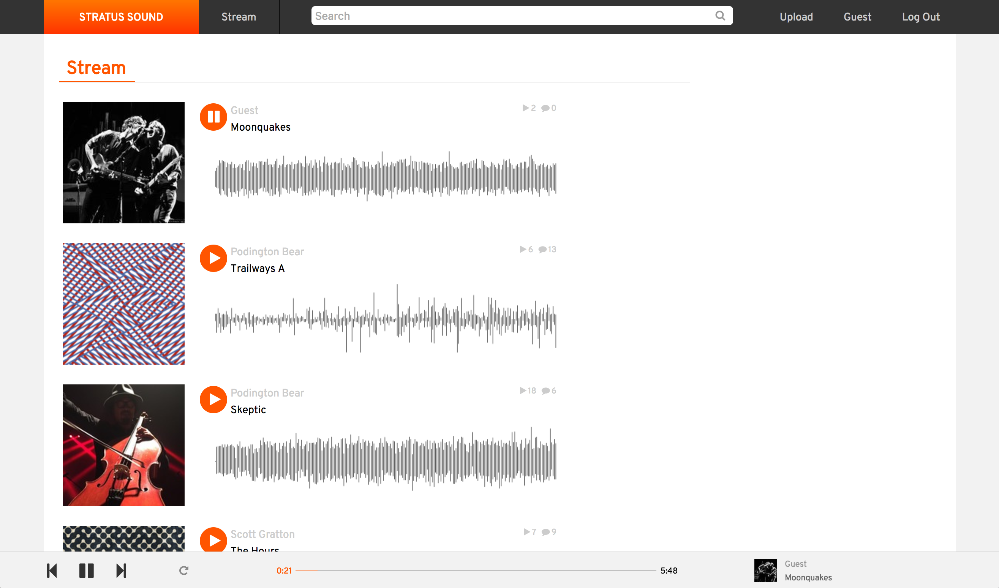
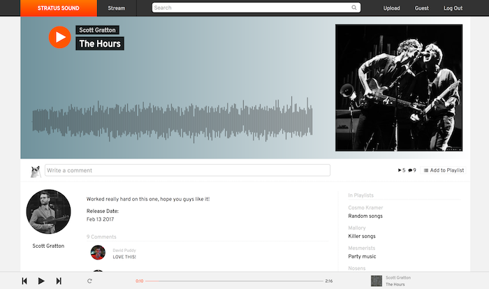
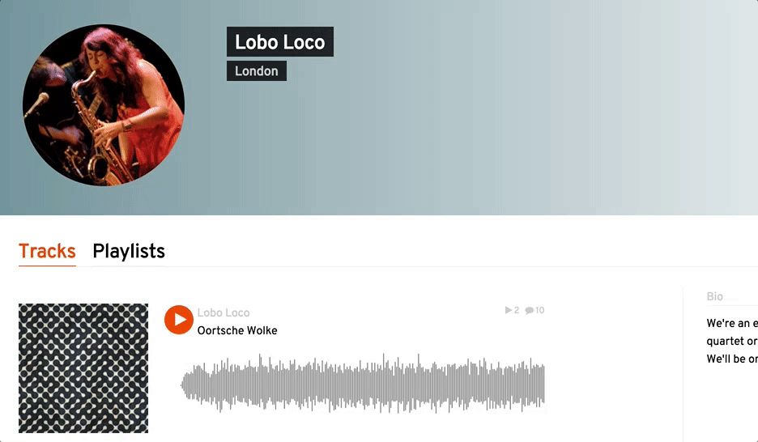

# Stratus Sound
[Stratus Sound live][heroku]

[heroku]: http://stratus-sound.us/

Stratus Sound is a single-page, full stack web application for streaming and sharing music. It utilizes Ruby on Rails with a PostgreSQL database on the backend, and React.js and Redux on the frontend.




### Features
* Upload, edit, delete and view tracks using the RESTful API
* Create and add songs to playlists
* Continuous track playback
* Comment on tracks
* View play counts for each track
* Search for users, tracks and playlists
* See all of a user's tracks and playlists on their page
* Secure account creation and login
* See waveform visualizations for each song
* Infinite scroll

### Technologies used
* React.js
* Redux
* BCrypt (for user authorization)
* Paperclip (for storing audio files and images with Amazon Web Services)
* figaro (for securely storing keys and other sensitive info)
* pg_search

## Features & Implementation

### Audio Waveforms


Waveform visualizations are shown for each track. The first time a track is viewed, the audio file is asynchronously decoded. After the audio is decoded, sample points of the resulting `AudioBuffer`'s `channelData` are extracted and used to draw the waveform on a Canvas element. The audio peaks are drawn to demonstrate the changes in sound pressure throughout the track. Finally, since extracting the peaks from an `AudioBuffer` is a time consuming process, the array of audio peaks is saved to the database as a JSON string. Upon subsequent renders of the track, the audio peaks data is simply retrieved from the database and the waveform draws instantly without having to re-process the audio data.

```javascript
let request = new XMLHttpRequest();
request.open('GET', this.props.track.audio_url, true);
request.responseType = 'arraybuffer';

request.addEventListener('load', () => {
  let context = window.audioContext;

  context.decodeAudioData(request.response).then((buffer) => {
    let channelData = buffer.getChannelData(0);
    let peaks = this.extractPeaks(channelData);
    this.props.savePeaks({ id: this.props.track.id, peaks: peaks });
  })
});
request.send();
```

### Music Playback


When a user clicks a track to play, a `Playbar` component is rendered. This component fetches the audio file (hosted with Amazon Web Services) and begins playback using a simple HTML5 audio element. The `Controller` component located within the `Playbar` allow users to pause, play, loop, restart and skip tracks. The current track and the song queue are stored in the app's state, allowing the user to navigate through the app with continuous audio playback. Users are also able to control the current song's play/pause state using the space bar, or by clicking any of the play buttons or waveforms throughout the app. All of these buttons are kept in sync with the currently playing track through the Redux `store`, maintaining a predictable experience for the user.

```javascript
<audio id='audio' autoPlay preload="auto" type="audio/mpeg"
  src={ track.audio_url }
  ref={ tag => this.audioTag = tag }
  onTimeUpdate={ this.updateProgress.bind(this) }
  onEnded={ this.playNextTrack.bind(this) } />
```

### Playlists and the Play Queue


Users are also able to browse and create playlists to store their favorite tracks. When playing music from a playlist, user page, or the Stream homepage, a play queue is generated and stored in the app's state. At the end of the current track, or if the user presses the skip button, the next track in the queue is played. The audio url is stored along with the songs in the queue so it does not need to be fetched from the database, allowing for a faster, smoother listening experience.

The playlists are organized using a `playlist_tracks` table in the database, which connects each Track to many playlists and each Playlist to many tracks. When a new playlist is created from a track's page, that track is automatically added to the playlist. If a playlist's last track is removed, the playlist itself is deleted.


## Future Plans
### Improved search
Stratus Sound currently uses pg_search to allow users to search for tracks, users and playlists at the same time. The search is configured to use both full text and trigram search, meaning that close/partial matches will also be returned as results. I plan to implement custom `pg_search_scope`s for Tracks to also allow search by genre and descriptions.

### Following
I plan to allow users to follow their favorite users. The **Stream** will then reflect updates from followed users, while a separate **Discover** feed will allow users to explore and find tracks from other users.

### ~~Pagination / infinite scroll~~ Completed
Currently viewing your stream will show all tracks on one page. However, with a larger number of tracks, this will cause the app to become too slow. I plan to implement pagination or infinite scroll to load data in more manageable batches.
